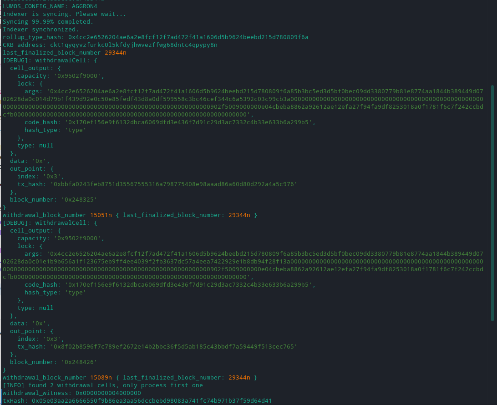
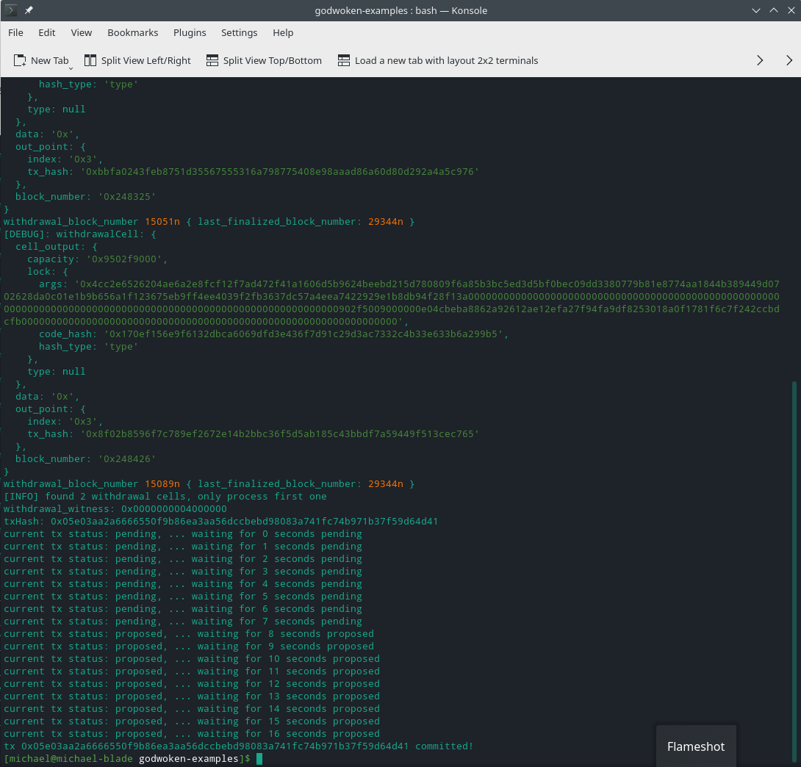

1. A screenshot of the console output immediately after running the "unlock" command.
   
   
   
   https://explorer.nervos.org/aggron/transaction/0x05e03aa2a6666550f9b86ea3aa56dccbebd98083a741fc74b971b37f59d64d41
   
2. The Ethereum address that you've used for your Layer 2 account (in text format).  
   0xA4C63521eE6F919B91c9eF00f4964E2e35bc6b0e
   
3. The Nervos Layer 1 address associated with the private key passed to "unlock" command (in text format). This is "
   ckb address" in the console output.
   
   ckt1qyqyvzfurkc0l5kfdyjhwvezffwg68dntc4qpypy8n
