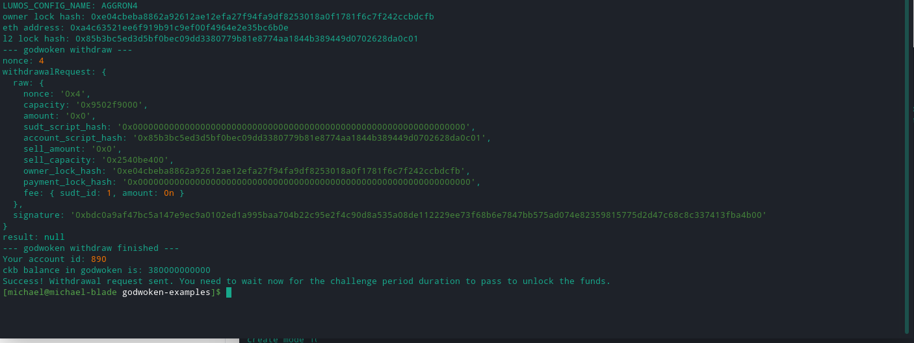

1. A screenshot of the console output immediately after running the withdraw command.
   

2. The Ethereum address that you've used for your Layer 2 account (in text format).  
   0xA4C63521eE6F919B91c9eF00f4964E2e35bc6b0e

3. The Nervos Layer 1 address that you passed to withdraw command (in text format).  
   ckt1qyqyvzfurkc0l5kfdyjhwvezffwg68dntc4qpypy8n
